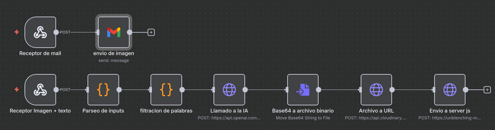

# AI Photo Experience with N8N

Aplicación web que combina captura de cámara, generación de texto y procesamiento de imágenes mediante IA. Permite describir un personaje, lugar y acción, tomar una foto y obtener una imagen personalizada generada con inteligencia artificial.

## 🚀 Características principales

- **Interfaz paso a paso**: Guía intuitiva a través de 5 pasos
- **Personalización creativa**: Descripción libre de personaje, lugar y acción
- **Captura en tiempo real**: Integración nativa con cámara web
- **Procesamiento IA**: Generación de imágenes usando N8N workflows
- **WebSocket**: Notificaciones en tiempo real del progreso
- **Marco personalizado**: Overlay automático en imagen final
- **Múltiples formatos**: Soporte para envío por email e impresión

## 🛠️ Tecnologías utilizadas

- **Frontend**: HTML5, CSS3, JavaScript (Vanilla)
- **Backend**: Node.js, Express.js
- **Comunicación**: WebSockets (ws)
- **Automatización**: N8N workflow integration
- **Túneles**: Ngrok para exposición de endpoints
- **Procesamiento**: Canvas API, Blob handling

## 📋 Requisitos del sistema

### Requisitos básicos
- **OS**: Linux (recomendado), Windows compatible con comandos modificados
- **Node.js**: Versión 16 o superior
- **Hardware**: Cámara web funcional
- **Red**: Conexión estable a internet

### Herramientas opcionales
- **Ngrok**: Con cuenta registrada para túneles públicos
- **N8N**: Instancia activa con workflow configurado

### Recursos multimedia requeridos
En la carpeta `resources/` se deben incluir:

1. **`back.jpg`** - Imagen de fondo para composición
2. **`marco.png`** - Marco decorativo para imagen final (opcional)
3. **`espera.mp4`** - Video de carga durante procesamiento

## 🚀 Instalación y configuración

### Paso 1: Preparación del entorno
```bash
# Clona el repositorio
git clone https://github.com/tu-usuario/AI-Photo-experience-with-N8N.git
cd AI-Photo-experience-with-N8N

# Instala dependencias
npm install
```

### Paso 2: Configuración de Ngrok
```bash
# Inicia túnel público
ngrok http 3000

# Anota la URL generada para configurar N8N
```

## 🛠️ Ejecución de la aplicación

### Método con Ngrok (recomendado para producción)
```bash
# Terminal 1: Inicia túnel
ngrok http 3000

# Terminal 2: Inicia servidor
node server.js
```

### Configuración N8N
1. Activa tu workflow de N8N
2. Configura el webhook endpoint con la URL de Ngrok
3. Verifica que el flujo responda correctamente

## 🎯 Guía de uso paso a paso

### Paso 1: Bienvenida 🎉
- La aplicación presenta la funcionalidad
- Click en **"Empezar"** para continuar

### Paso 2: Descripción creativa ✨
**Completa los tres campos obligatorios:**
- **Personaje**: Cómo quieres verte (ej: "detective", "chef", "explorador")
- **Lugar**: El escenario deseado (ej: "en París", "en una cocina", "en la selva")
- **Acción**: Qué estás haciendo (ej: "resolviendo misterios", "cocinando", "descubriendo")

### Paso 3: Captura de imagen 📸
- **"Abrir Cámara"** → Permite acceso a la cámara
- **"Sacar Foto"** → Captura la imagen
- **"Intentar de nuevo"** → Repite la captura si es necesario
- **"Enviar"** → Procesa la imagen con IA

### Paso 4: Procesamiento IA 🤖
- N8N recibe y procesa tu solicitud
- El video de espera se reproduce automáticamente
- WebSocket notifica cuando termina el procesamiento
- **"Ver Resultado"** aparece al completarse

### Paso 5: Resultado final 🎨
- Visualiza tu imagen transformada
- **Opciones disponibles**:
  - **"Tomar otra foto"**: Reinicia desde captura
  - **"Siguiente"**: Continúa al paso final
- **Paso final**: Ingresa email para recibir la imagen o imprime directamente

## ⚙️ Flujo N8N - Arquitectura del Workflow



El procesamiento de imágenes se realiza mediante un workflow automatizado en N8N que consta de 9 nodos especializados:

### 📥 **Fase 1: Recepción y Preprocesamiento**

#### 🔗 **Webhook Receptor** 
- **Función**: Endpoint que recibe la imagen capturada y el texto descriptivo desde la aplicación web
- **Input**: FormData con imagen (JPEG) + JSON con descripción (personaje, lugar, acción)
- **Output**: Datos estructurados para procesamiento interno

#### 🔧 **Code - Parseo de Inputs**
- **Función**: Extrae y estructura los datos del texto descriptivo
- **Proceso**: Convierte el texto libre en objeto JSON estructurado
- **Validación**: Verifica integridad de campos obligatorios
```javascript
// Ejemplo de output
{
  "personaje": "detective",
  "lugar": "en Londres", 
  "accion": "resolviendo misterios"
}
```

#### 🛡️ **Code - Filtración de Palabras**
- **Función**: Sistema de moderación de contenido para prevenir errores de IA
- **Proceso**: 
  - Detecta palabras sensibles, inapropiadas o problemáticas
  - Reemplaza términos conflictivos con alternativas seguras
  - Optimiza prompts para mejor respuesta de la IA
- **Beneficio**: Reduce fallos y mejora calidad de generación

### 🤖 **Fase 2: Generación de IA**

#### 🎨 **HTTP Request - Llamada a IA**
- **Función**: Envía imagen + prompt procesado al servicio de IA generativa
- **APIs compatibles**: Stable Diffusion, DALL-E, Midjourney, etc.
- **Input**: Imagen base + descripción filtrada
- **Output**: Imagen generada en formato Base64
- **Timeout**: Configurado para esperas largas (30-120 segundos)

#### 📄 **Base64 to File**
- **Función**: Convierte la respuesta Base64 en archivo binario manipulable
- **Formato**: Genera archivo JPEG/PNG dentro del contexto N8N
- **Optimización**: Mantiene calidad mientras reduce tamaño si es necesario

### 🌐 **Fase 3: Distribución y Almacenamiento**

#### ☁️ **HTTP Request - Upload a Cloudinary** 
- **Función**: Sube la imagen generada a servicio de CDN/almacenamiento
- **Alternativas**: Google Drive, AWS S3, Dropbox, Firebase Storage
- **Output**: URL pública accesible de la imagen
- **Configuración**: Optimización automática de formatos (WebP, AVIF)

#### 📡 **HTTP Request - Notificación al Cliente**
- **Función**: Envía URL de imagen final al servidor web via WebSocket
- **Endpoint**: POST al servidor Express en `/notify`
- **Payload**: `{ "url": "https://cloudinary.com/image.jpg" }`
- **Trigger**: WebSocket broadcast a clientes conectados

### 📧 **Fase 4: Entrega por Email (Opcional)**

#### 📬 **Webhook Receptor de Email**
- **Función**: Endpoint secundario para solicitudes de envío por correo
- **Input**: Email del usuario + URL de imagen procesada
- **Activación**: Cuando usuario completa formulario final

#### 📮 **Gmail - Envío Automatizado**
- **Función**: Envía la imagen personalizada al email proporcionado
- **Template**: Email HTML con imagen embebida y mensaje personalizado
- **Adjuntos**: Imagen en alta resolución como attachment
- **Configuración**: Cuenta Gmail con App Password configurada

## Personalización de recursos
- **Imagen de fondo**: Reemplaza `back.jpg` con resolución recomendada 1920x1080
- **Marco**: `marco.png` debe ser transparente, tamaño 1024x1024 o puede ser mas grande.
- **Video de espera**: `espera.mp4` en formato MP4, duración recomendada 1:30 min

## 🛟 Solución de problemas comunes

### ❌ La cámara no funciona
- **Navegador**: Asegúrate de dar permisos de cámara
- **HTTPS**: En producción usa HTTPS para acceso a cámara
- **Hardware**: Verifica que la cámara no esté siendo usada por otra aplicación

### ❌ No se recibe respuesta de N8N
- **Webhook**: Verifica que la URL de N8N sea correcta
- **Workflow**: Confirma que el flujo esté activo
- **Ngrok**: Revisa que el túnel siga funcionando
- **Logs**: Consulta la consola del servidor para errores

### ❌ Errores de WebSocket
- **Firewall**: Verifica que el puerto 3000 esté abierto
- **Proxy**: Algunos proxies bloquean WebSockets
- **Navegador**: Prueba en modo incógnito

## 📧 Soporte y contribuciones

- **Issues**: Reporta problemas en el repositorio
- **Pull Requests**: Contribuciones son bienvenidas
- **Documentación**: Ayuda a mejorar esta guía

## 📝 Comentarios del creador
Este proyecto fue parte de un evento propio usando N8N por primera vez, debe poder mejorarse, esta libre a uso como a mejora :)